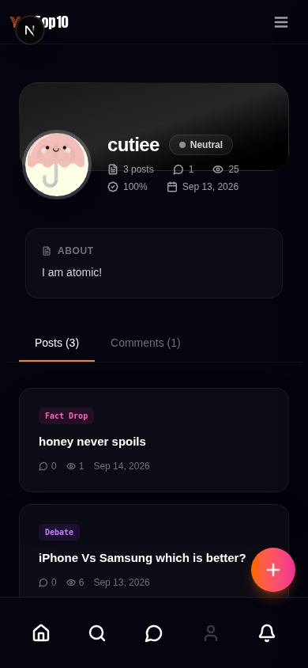

# YoTop10

> **Fact mine. Debate ground. Your list vs the world.**

[](https://github.com/cocor-tech/yotop10/actions/workflows/ci.yml) [](https://github.com/cocor-tech/yotop10/actions/workflows/cd.yml) [](https://github.com/cocor-tech/yotop10/stargazers)

**[www.yotop10.com](https://www.yotop10.com)** ·
**[📖 Handbook: *Fact Mine, Debate Ground* (PDF)](https://github.com/cocor-tech/yotop10/releases/download/handbook-v1/handbook.pdf)** ·
**[(EPUB)](https://github.com/cocor-tech/yotop10/releases/download/handbook-v1/handbook.epub)** ·
**[Handbook source](./docs/handbook/)** ·
**[Documentation](./docs/product_spec.md)** ·
**[Report a bug](https://github.com/cocor-tech/yotop10/issues)** ·
**[Request a feature](https://github.com/cocor-tech/yotop10/issues)**

YoTop10 is an open publishing platform for ranked lists — Wikipedia × Social Feed.
Anyone can browse, submit, and comment with no account and no login. Quality is
kept by admin curation, not by sign-up walls: every submission passes human
review before it goes live.

Similar to Reddit or Hacker News in spirit, but built around one question:
*what's your top 10?* Lists, head-to-head debates, and sourced fact drops —
ranked, challenged, and countered in the open.

## How it works

1. **Browse** — the feed, explore, categories, Hall of Fame, and full-text
   search are all public. No account, no cookie wall, no tracking wall.
2. **Submit** — anyone can draft a list, debate, fact drop, or article with
   autosaving drafts, per-item images, and source citations.
3. **Review** — submissions sit in a double-blind human review queue
   (with AI-assisted pre-screening and title-collision detection) until an
   admin approves them. Nothing goes live unreviewed.
4. **Debate** — readers vote on sides, fire the arguments they agree with,
   and write counter-lists that challenge any ranking.
5. **Earn trust** — good contributions raise your trust tier, which unlocks
   higher rate limits. Trust is earned, not bought and not granted at sign-up.

## Screenshots

| Desktop | Mobile |
| ------- | ------ |
|  |  |

## Content types

| Type | Description | Example |
|---|---|---|
| **Top List** | Ranked items with written justification per item | "Top 10 Most Influential Scientists Ever" |
| **This vs That** | Two-item head-to-head with side voting | "iPhone vs Samsung — which is better?" |
| **Who Is Better** | Multi-candidate comparison | "Messi, Ronaldo, Pelé — Final Verdict" |
| **Best / Worst Of** | Time-scoped or inverse curated lists | "Best Movies of 2024" |
| **Hidden Gems** | Underrated topics | "10 Countries No One Talks About" |
| **Counter List** | A direct rival challenging an existing list | "My rebuttal to your Top 10 Rappers" |
| **Fact Drop** | Short sourced statement or discovery | "Honey never spoils" |
| **Article** | Long-form knowledge piece with sources | Deep dives with cover art and citations |

## Features

- **Publish** — submit lists, debates, facts, and articles with per-item images,
  source citations, categories (341 and counting), and autosaving drafts.
- **Debate** — side voting with live splits, counter-lists that challenge any
  ranking, argument threads with fire-weighted rebuttals.
- **Identity without passwords to browse** — see below; accounts are optional
  and only needed to submit and interact.
- **Quality** — double-blind human review queue, AI-assisted pre-screening,
  title-collision detection, rate limits that scale with trust.
- **Profiles & discovery** — bios, link handles, full-text search with
  autocomplete, Hall of Fame, sitemaps and SEO throughout.
- **Admin** — review queues for posts and articles, moderation, user trust and
  restriction tools, audit logs, platform statistics, and a moderator system
  (31 permissions, 4 presets, 3-layer enforcement).

## Identity & trust model

- **Accounts** (optional): email + password with OTP verification, trusted
  devices (password-only on a trusted device), and optional 2FA (TOTP +
  recovery codes).
- **Sessions**: httpOnly `session_token` JWT cookie, 7-day expiry, rotated on
  password change (`token_version`).
- **Guests**: a `guest_id` cookie allows low-visibility commenting
  (5/hr, guest name 3–32 chars) and firing (20/hr) with no account at all.
- **Trust tiers** scale rate limits; admin curation keeps the feed clean.
  (The earlier fingerprint/crypto-identity subsystem was removed in M41 in
  favor of this model.)

## Architecture

```
frontend/   Next.js 15 (App Router, SSR, TypeScript) — the site
backend/    Express + TypeScript API — Zod-validated endpoints
docs/       product spec, codebase audit (ROM), milestones, handbook
```

- [Next.js 15](https://nextjs.org/) — frontend (App Router, SSR)
- [Express](https://expressjs.com/) — API backend (TypeScript)
- [MongoDB 7](https://www.mongodb.com/) — primary data store
- [Redis 7](https://redis.io/) — cache, rate limits, sessions
- [Elasticsearch 8](https://www.elastic.co/) — full-text search
- [Docker Compose](https://docs.docker.com/compose/) — one-command self-hosting
- nginx — TLS termination, serves www (apex 301s to www)

## Self-host

```sh
cp .env.example .env   # fill in secrets (never commit .env)
docker compose up -d --build
```

The stack serves on port 80/443 (configure `NGINX_SERVER_NAME` and TLS
certificates via the provided nginx template). Moving an existing instance?
See [docs/db-restore.md](./docs/db-restore.md) — the whole database is a
single portable archive, and uploads merge newest-wins.

## Development

```sh
pnpm install --frozen-lockfile
pnpm dev:docker          # full stack with hot reload (recommended)
# or per package:
# (cd frontend && pnpm dev)   # Next.js on :3000
# (cd backend && pnpm dev)    # API on :8000
```

Every change must pass the gates before commit:

```sh
pnpm typecheck && pnpm lint && pnpm build && pnpm test
```

Start with [docs/product_spec.md](./docs/product_spec.md) (what the platform is),
[docs/rom.md](./docs/rom.md) (codebase audit and decisions), and
[AGENTS.md](./AGENTS.md) (mandatory workflow rules for contributors).

## For AI agents and bots

This repo is agent-operated. Before changing anything:

1. **Read `AGENTS.md` in full** — it defines the mandatory workflow, quality
   gates, and rules (no glow/neon styles, Lucide icons only, Zod validation
   on every API input, no secrets in commits).
2. **Read `ram.md`** — current task state, what just shipped, what's open.
3. Follow the commit format **`[MXX.X] Description`** and keep all docs
   (`ram.md`, `docs/milestones.md`, `docs/rom.md`, `docs/product_spec.md`)
   in sync with the code.
4. Never push to `origin`/`main` without the owner's go-ahead — pushes to
   this repo's `main` deploy to production (see CI/CD below).

## Milestone status

- **Shipped**: M1–M42 — foundation, schemas, submit/feed/detail, categories,
  comments, admin auth & dashboard, user system, search, arguments, Hall of
  Fame, moderator system (M17), SEO/OG platform overhaul (M24), premium UI
  passes (M32–M38), CI/CD auto-deploy (M39), engagement overhaul (M40),
  and **M41 — real authentication system** (email/password + OTP, trusted
  devices, optional 2FA, session/guest cookies).
- **Open**: M5.6 Counter-List System ("The Arena"), M10.7 categories
  management UI, M10.14 remaining admin components, V2.x features.
- See [docs/milestones.md](./docs/milestones.md) and
  [docs/not-implemented.md](./docs/not-implemented.md) for the full picture.

## CI/CD

Pushing to `main` on this repository triggers GitHub Actions, which builds the
stack and deploys to **www.yotop10.com** over SSH (with a boot probe and
auto-rollback). Documentation-only pushes (`.md`, `docs/`) are skipped by the
deploy workflow. A separate `ci.yml` runs typecheck/lint/build gates on every
push, and `cd.yml` publishes container images.

## Support & security

- Bugs and feature requests: [GitHub Issues](https://github.com/cocor-tech/yotop10/issues).
- Security vulnerabilities: please report privately to the repository owner —
  do not open a public issue.

## License

© YoTop10. All rights reserved. Proprietary — no license is granted to use,
copy, modify, or distribute this software except as expressly agreed with the
owner.
